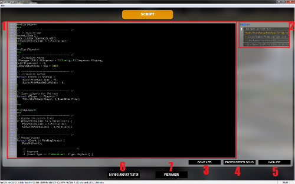
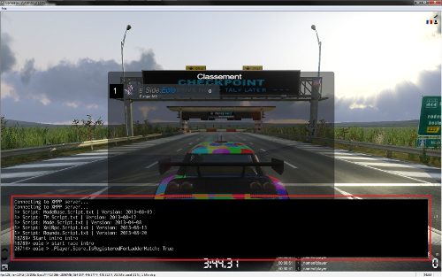
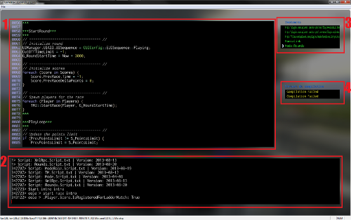

# Introduction

## What is ManiaScript?

ManiaScript is a scripting language integrated to ManiaPlanet that allows the players to customize different aspects of the games. A scripting language is build upon a classic programming language and aims to ease the process of creation.

## What can I do with it?

### Rules

The rules script is used by the servers. It defines the structure and the rules of the game modes. With this you can choose how the players are spawned on the map, how the points are awarded, who will win at the end of the match, create a specific user interface and much more.

### Map Type

The map type script is used in the map editor. It defines the rules a map must follow to be considered valid. You can by example force the map to have two spawns and three poles, each one using a different tag. Then inside the rules script, you can set a list of map type to define which maps are compatible with your mode.

### ManiaLink

ManiaLink is a presentation language allowing the players to create user interfaces and small websites inside ManiaPlanet. You can integrate a script inside your ManiaLinks to make them dynamic (much like HTML and JavaScript). It means that you can change text values or move elements of your ManiaLink from a script. With this you can display a top 10 of the best players in your mode by example.

### Map editor plugins

It's possible to extend the possibilities of the map editor with plugins written in ManiaScript. These plugins range from the simple autosave to the full random map generator.

### ManiaPlanet plugins

The global plugins are not available to the players at the time being. Once it will be the case, it will be possible to create small tools directly inside ManiaPlanet. You will be able to improve the current buddy system or create a new instant messenger by example.

## Tools

### InGame editor

The easiest way to create and edit scripts is to use the in-game editor. It is accessible through different ways depending of which kind of script you want to create.

- Rules: create an ingame server (online or LAN) and select the mode you want to edit. Once you're playing on the server, press F12 to open the editor.
- Map type: launch the map editor, select the map type you want to edit on the top left of the screen and then press F12.
- Map editor plugin: launch the map editor and click on the plugin icon on the bottom of the screen. Then just click on the create button on the left of the screen. If you want to edit an existing script, click on the small "+" button above a plugin and after on the edit button on the left of the screen.

1. The main working area, this is were you'll type your script. 
2. The include panel displays all the external scripts used by your own script.
3. The "Compile" button allows you to check if there's no error in your script.
4. The "Save as" button allows you to save the current script at a specific location with a new file name.
5. The "Include" button displays or hides the include panel (2).
6. The "Save and test" button saves all the open scripts and lets you test your game mode on the server.
7. The "Close" button lets you exit the script editor, __but you'll loose all the unsaved modifications__.

While playing you can press ctrl+g to open the log window. This window will be essential when developing a new script, but we will see later how to use it efficiently.

If you press ctrl+g a second time you will open the full debug window (and a third time will close it).

1. The script you are currently debugging. If there's an error in the script, the window will display the line causing the error.
2. The log window.
3. A list of all the running scripts. You can click on each script to open it in the left area. The scripts containing errors will be displayed in red.
4. A list of all the previous compilation errors. You can click on each error to have more information about it.

### Editor shorcuts

While playing:

  * F12: open the script editor
  * ctrl + g: open the log window / open the debug window / close the debug window
  
While editing a script
  
  * ctrl + a: select all
  * ctrl + z: undo
  * ctrl + y: redo
  * ctrl + f: search
  * ctrl + g: go to line #
  * ctrl + h: search and replace
  * ctrl + c: copy the selection
  * ctrl + x: cut the selection
  * ctrl + v: paste the selection
  * ctrl + home: go to the beginning the script
  * ctrl + end: go to the end of the script
  * ctrl + numpad+: increase the font size
  * ctrl + numpad-: decrease the font size
  * ctrl + F3: quick search next on the selection
  * ctrl + shift + F3: quick search previous on the selection

### External tools

It's not recommended to do that when you begin to write scripts, but you can also edit them with any text editor. __Be aware that ManiaPlanet cache some resources like the scripts. So if you update a script with an external editor it won't be reloaded in the game at the same time.__ Most of the time you have to restart the server running the script to get the new version.

You can check [the links section](../general/links.html#tools) of the documentation to get some useful tools to enhance the ManiaScript support in different text editors (syntax highlighting and auto-completion).

## How to extract the Nadeo scripts

You can find the latest [Nadeo's scripts on GitHub](https://github.com/maniaplanet/game-modes), but you can also extract them from your installation. To do that you must go inside this folder: `C:\ProgramData\ManiaPlanet\PacksCache`.
It's the default path, so maybe you changed it during the installation process. The ProgramData directory is an hidden directory, so you have to edit your Windows settings to display it.

Inside the folder you will find a lot of .zip. They contain the default ManiaPlanet data. The ones we are interested in are:
- ShootMania_extras.zip
- TrackMania_extras.zip
- ManiaPlanet_extras.zip
If you unzip these directories on your desktop you'll find a `Scripts` folder inside with all the Nadeo scripts.

## Script folder structure

ManiaPlanet stocks its data in two directories. The original Nadeo data are saved in the `ProgramData\ManiaPlanet` folder. The custom files created by the players are saved in the `Documents\ManiaPlanet` folder. But once you launch the game, ManiaPlanet will automatically merge the two folders together to display them as one.

Something to be aware of is, if a file has the same name in the same folder in `ProgramData\ManiaPlanet` and `Documents\ManiaPlanet`, ManiaPlanet ignores the one in `ProgramData\ManiaPlanet` and uses the one in `Documents\ManiaPlanet` instead. It's really useful if you want to customize some elements, like the scripts. You don't have to modify the original ones, just copy them at the same location inside your ManiaPlanet directory.

The `Scripts` folder uses this structure:

    Scripts
    |-EditorPlugins
    |-Libs
      |-Nadeo
        |-ShootMania
        |-TrackMania
    |-MapTypes
      |-ShootMania
      |-TrackMania
    |-Modes
      |-ShootMania
      |-TrackMania

By default your `Scripts` folder will be empty. You'll have to create the sub-folders yourself. You're free to organize them as you wish, but it's highly recommended to stick to the structure presented above. Especially because of the merge of the two ManiaPlanet folders.
